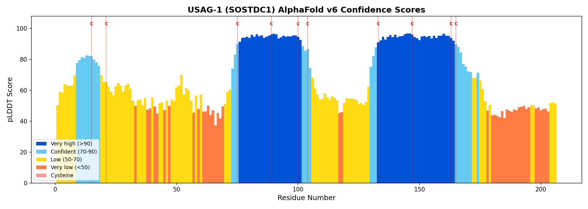
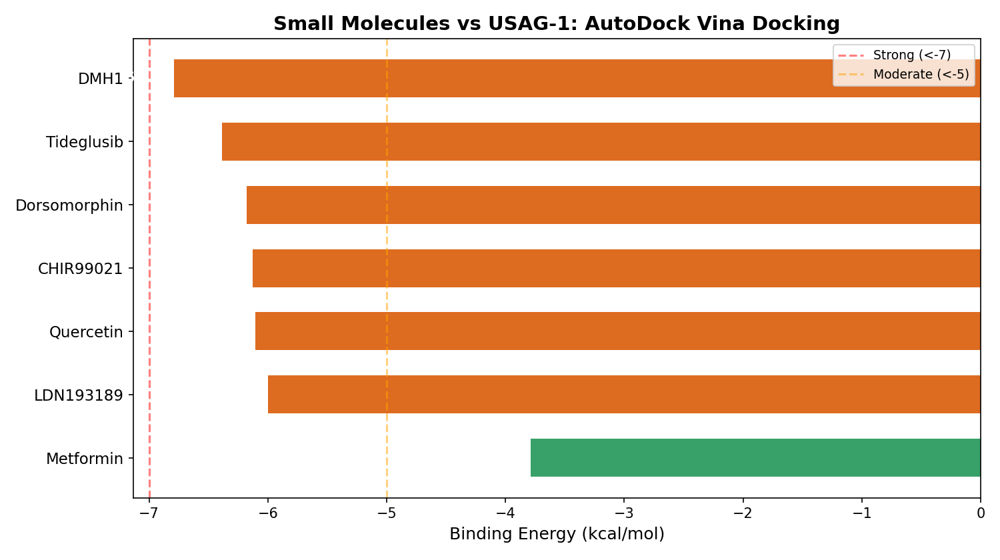

# Open Tooth Regeneration

**Applying AI drug discovery techniques to accelerate tooth regeneration — a field with zero existing open-source projects.**

## Why This Exists

Two revolutions are happening in parallel:

1. **Tooth regeneration is real.** The world's first drug to regrow human teeth ([TRG-035](https://toregem.co.jp/en/), an anti-USAG-1 antibody) entered Phase I clinical trials in October 2024. Target: commercial availability by 2030.

2. **AI drug discovery works.** AI-designed antibodies are already in human trials ([Absci](https://www.absci.com/), [Insilico Medicine](https://insilico.com/)). Generative AI can design novel drug candidates in months instead of years.

**These two fields have never intersected.** There is not a single project on GitHub, Kaggle, or Hugging Face that applies AI drug discovery to tooth regeneration. This project aims to change that.

## Results So Far

### USAG-1 Structure Analysis (AlphaFold v6)

We analyzed the AlphaFold-predicted structure of USAG-1 (206 residues, 10 cysteines forming a cystine knot domain):



- **41% of residues** have high AlphaFold confidence (pLDDT > 70) — reliable for drug design
- **Two high-confidence core regions** identified:
  - Residues 73-105 (mean pLDDT: 92.2) — contains Loops 3-4
  - Residues 130-171 (mean pLDDT: 91.2) — contains Loops 7-8
- These loops are the most likely **BMP/LRP5/6 binding sites** and prime targets for inhibitor design

### Molecular Docking: Small Molecules vs USAG-1

First-ever computational docking screen against USAG-1 using AutoDock Vina:



| Rank | Compound | Energy (kcal/mol) | Type |
|------|----------|-------------------|------|
| 1 | **DMH1** | **-6.8** | BMP inhibitor |
| 2 | Tideglusib | -6.4 | GSK-3 inhibitor (tested in dental) |
| 3 | Dorsomorphin | -6.2 | BMP inhibitor |
| 4 | CHIR99021 | -6.1 | Wnt activator |
| 5 | Quercetin | -6.1 | Natural flavonoid |
| 6 | LDN-193189 | -6.0 | BMP receptor inhibitor |
| 7 | Metformin | -3.8 | Too small (MW=129) |

**Key finding:** BMP pathway compounds show stronger binding to USAG-1, consistent with its biological role as a BMP antagonist. DMH1 is the top hit at -6.8 kcal/mol (moderate binding). This is a starting point — further optimization with generative chemistry models could yield stronger candidates.

## What's Here

### Data
- USAG-1/SOSTDC1 protein structure from [AlphaFold DB](https://alphafold.ebi.ac.uk/entry/Q6X4U4) (v6)
- Structure analysis results (`usag1_analysis.json`, `usag1_plddt_analysis.png`)
- Docking results (`docking_results.json`, `docking_results.png`)
- Links to public dental single-cell transcriptomic datasets
- Curated BMP/Wnt pathway data relevant to tooth development

### Notebooks
- `01_usag1_structure.ipynb` — Visualize USAG-1 3D structure and identify binding sites

### Literature
- Key papers connecting tooth regeneration biology with AI capabilities

## The Science

**USAG-1** (gene: SOSTDC1) is a protein that simultaneously blocks BMP and Wnt signaling — two pathways essential for tooth development. It acts as a molecular brake. Neutralizing USAG-1 with an antibody releases dormant tooth buds, allowing new teeth to grow.

The current antibody (TRG-035) was found through traditional hybridoma screening in the 2000s-2010s. It may not be optimal. AI could:

- **Design better antibodies** with higher affinity and selectivity (blocking BMP interaction without affecting Wnt)
- **Design small molecule inhibitors** — potentially reducing treatment cost by 100x
- **Mine single-cell data** to determine if adults retain activatable tooth progenitor cells
- **Accelerate clinical trials** through synthetic control arms and adaptive design

## Key Resources

| Resource | Description |
|----------|-------------|
| [AlphaFold: Q6X4U4](https://alphafold.ebi.ac.uk/entry/Q6X4U4) | USAG-1 predicted 3D structure |
| [Murashima-Suginami et al., 2021](https://www.science.org/doi/10.1126/sciadv.abf1798) | Original anti-USAG-1 antibody paper (*Science Advances*) |
| [Tooth_sciRNAseq](https://github.com/Ruohola-Baker-lab/Tooth_sciRNAseq) | Human tooth development single-cell atlas |
| [TheMoorLab/Tooth](https://github.com/TheMoorLab/Tooth) | Periodontal/dental pulp single-cell atlas |

## Known Challenges

- **Amelogenin** (key enamel protein) is an intrinsically disordered protein — AlphaFold can't model it well
- **Four signaling pathways** (BMP, Wnt, FGF, Shh) interact with context-dependent effects
- **Data scarcity** — this is a small field with limited machine-readable data
- **Wet-lab validation** is irreplaceable — computational predictions need experimental confirmation

## How to Contribute

This project needs collaborators with:
- Structural biology / computational chemistry expertise
- Dental developmental biology knowledge
- Medicinal chemistry / drug design experience

The AI tooling is ready. The data is public. What's missing is the interdisciplinary bridge.

**Open an issue** or submit a PR if you're interested.

## License

MIT

## Citation

If you use this work, please cite:
```
@misc{open-tooth-regen,
  title={Open Tooth Regeneration: AI-Driven Approaches to Accelerate Tooth Regeneration},
  year={2026},
  url={https://github.com/yaowubarbara/open-tooth-regen}
}
```
